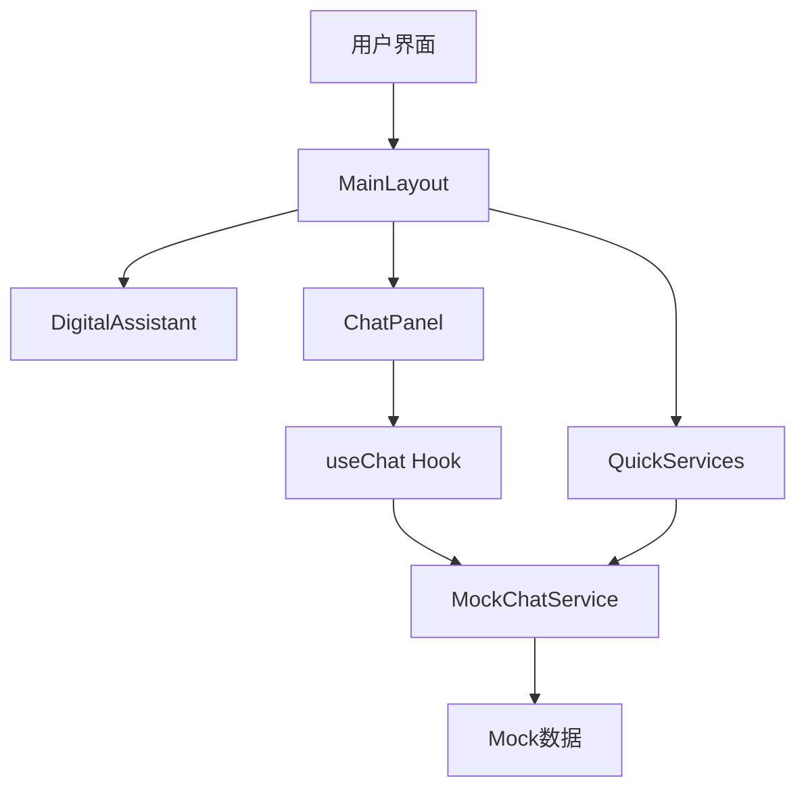
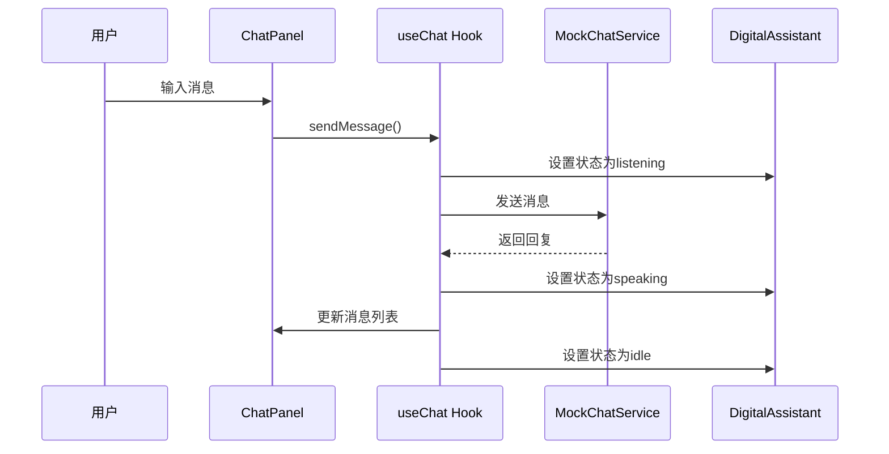

# 技术设计

## 需求追溯
基于 requirements.md 中的需求：
- FR-001 数字助手界面初始化 → MainLayout + DigitalAssistant 组件
- FR-002 聊天对话功能 → ChatPanel + useChat Hook + Mock服务
- FR-003 快捷服务功能 → QuickServices 组件 + 服务数据
- FR-004 系统状态管理 → React状态管理 + 加载状态
- FR-005 品牌界面展示 → 主题配置 + Logo组件

## 系统架构



## 组件设计

### MainLayout 主布局
- **职责**: 整体页面布局，管理全局状态
- **文件**: `src/components/MainLayout.tsx`
- **Props**: 无
- **状态**: 管理消息列表、数字人状态、加载状态

### DigitalAssistant 数字人组件
- **职责**: 展示小鹏Iron数字人形象和状态
- **文件**: `src/components/DigitalAssistant.tsx`
- **Props**: 
  ```typescript
  interface DigitalAssistantProps {
    status: 'idle' | 'speaking' | 'listening';
    avatar?: string;
  }
  ```

### ChatPanel 聊天面板
- **职责**: 消息展示和输入界面
- **文件**: `src/components/ChatPanel.tsx`
- **Props**:
  ```typescript
  interface ChatPanelProps {
    messages: Message[];
    onSendMessage: (text: string) => void;
    loading?: boolean;
  }
  ```

### QuickServices 快捷服务
- **职责**: 企业服务快捷入口
- **文件**: `src/components/QuickServices.tsx`
- **Props**:
  ```typescript
  interface QuickServicesProps {
    onServiceClick: (serviceId: string) => void;
  }
  ```

### useChat Hook
- **职责**: 聊天状态管理和消息处理
- **文件**: `src/hooks/useChat.ts`
- **返回值**:
  ```typescript
  interface UseChatReturn {
    messages: Message[];
    sendMessage: (text: string) => Promise<void>;
    loading: boolean;
  }
  ```

## 数据模型

### Message 消息
```typescript
interface Message {
  id: string;
  type: 'user' | 'assistant';
  content: string;
  timestamp: Date;
}
```

### Service 服务
```typescript
interface Service {
  id: string;
  name: string;
  icon: string;
  description: string;
}
```

### AppState 应用状态
```typescript
interface AppState {
  messages: Message[];
  assistantStatus: 'idle' | 'speaking' | 'listening';
  loading: boolean;
}
```

## Mock服务设计

### MockChatService
- **文件**: `src/services/mockChatService.ts`
- **方法**:
  ```typescript
  class MockChatService {
    async sendMessage(text: string): Promise<Message>;
    async getQuickReply(serviceId: string): Promise<Message>;
  }
  ```

### Mock数据
- **文件**: `src/data/mockData.ts`
- **内容**: 预设对话回复、企业服务列表、数字人状态

## 技术选型

- **状态管理**: React useState + useContext
- **样式方案**: Ant Design + CSS Modules
- **数据存储**: localStorage (对话历史)
- **图标**: Ant Design Icons
- **响应式**: Ant Design Grid系统

## 文件结构
```
src/
├── components/
│   ├── MainLayout.tsx
│   ├── DigitalAssistant.tsx
│   ├── ChatPanel.tsx
│   └── QuickServices.tsx
├── hooks/
│   └── useChat.ts
├── services/
│   └── mockChatService.ts
├── data/
│   └── mockData.ts
├── types/
│   └── index.ts
└── App.tsx
```

## 数据流
```
用户输入 → ChatPanel → useChat Hook → MockChatService → 状态更新 → UI重渲染
```

## 响应式设计
- **桌面端**: 左侧数字人展示，右侧聊天面板
- **移动端**: 上下布局，数字人区域缩小
- **断点**: 使用Ant Design的响应式断点 (xs, sm, md, lg, xl)

## 性能优化
- 消息列表虚拟滚动（超过100条消息时）
- 图片懒加载
- 组件懒加载
- Mock服务添加延迟模拟真实网络请求

## 品牌设计
- **主题色**: 小鹏品牌蓝色渐变
- **Logo位置**: 界面底部居中
- **页面标题**: "小鹏Iron数字助手平台"
- **数字人形象**: 使用RobotOutlined图标或自定义头像

## 状态管理流程


