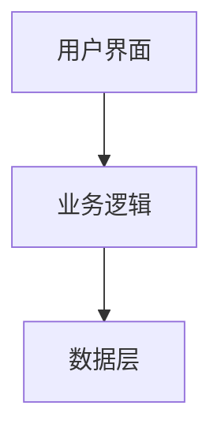
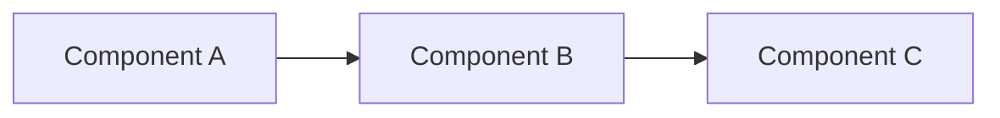

# Technical Design

<!-- 
模板说明：
- 此文件由 design-agent 生成
- 定义系统架构和技术方案
- 为 development-agent 提供实现指导
-->

## Overview

**Feature Name**: [功能名称]
**Version**: 1.0
**Date**: [日期]

## Architecture

### System Architecture



### Component Architecture



## Component Design

### [Component Name]

**Responsibility**: [职责描述]

**Interface**:
```typescript
interface ComponentProps {
  prop1: string;
  prop2: number;
  onAction?: () => void;
}
```

**Dependencies**:
- [依赖1]
- [依赖2]

## Data Model

### [Entity Name]

```typescript
interface Entity {
  id: string;
  name: string;
  createdAt: Date;
  updatedAt: Date;
}
```

### State Management

```typescript
interface AppState {
  user: UserState;
  data: DataState;
  ui: UIState;
}
```

## API Design (如适用)

### [API Endpoint]

- **Method**: GET / POST / PUT / DELETE
- **Path**: `/api/resource`
- **Request**:
  ```json
  {
    "field": "value"
  }
  ```
- **Response**:
  ```json
  {
    "success": true,
    "data": {}
  }
  ```

## Error Handling

| Error Code | Description | User Message |
|------------|-------------|--------------|
| E001 | [错误描述] | [用户提示] |
| E002 | [错误描述] | [用户提示] |

## Security Considerations

- [安全考虑1]
- [安全考虑2]

## Performance Considerations

- [性能考虑1]
- [性能考虑2]
