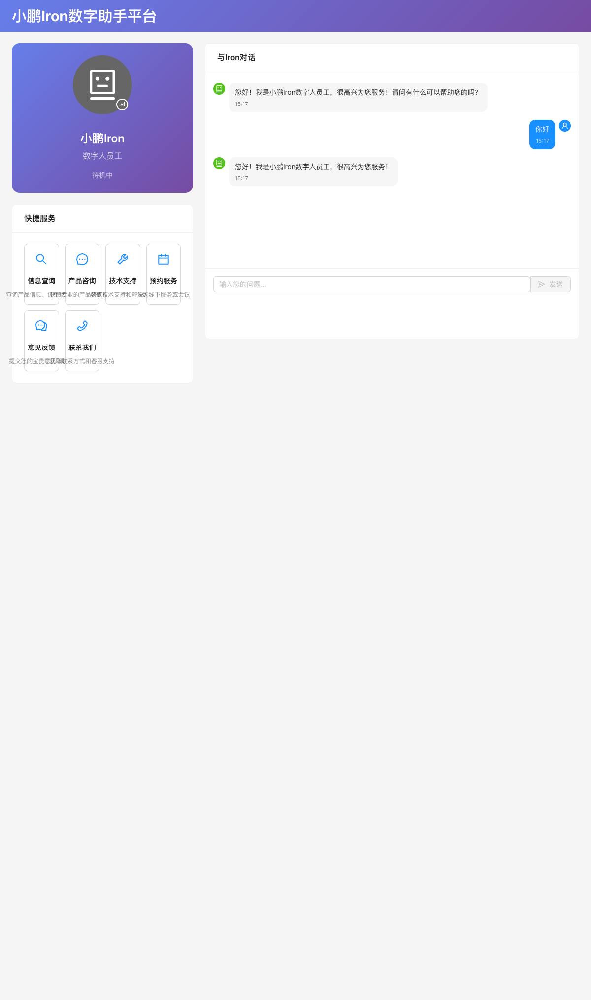
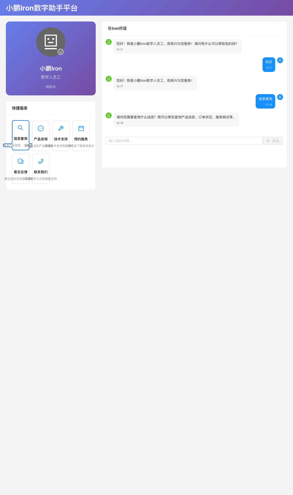
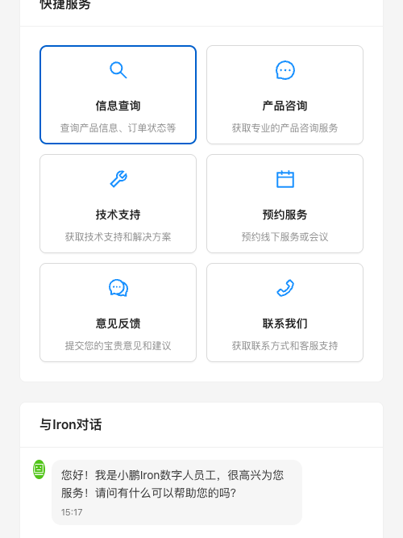

# 测试报告 - 小鹏Iron数字助手平台

## 概览
- **Feature**: integrated-assistant-demo
- **测试时间**: 2026-01-01 15:17
- **结果**: ✅ 通过
- **通过率**: 4/4 (100%)

## 测试环境
| 配置项 | 值 |
|--------|-----|
| 测试地址 | http://localhost:5173 |
| 浏览器 | Chrome (headless) |
| 测试时间 | 2026-01-01 15:17-15:18 |

## 测试用例执行详情

### TC-001: 页面初始加载
- **状态**: ✅ 通过
- **关联需求**: FR-001 (AC1.1, AC1.2, AC1.3)

| 步骤 | 操作 | 预期结果 | 实际结果 | 截图 |
|------|------|----------|----------|------|
| 1 | 访问应用首页 | 显示数字人界面和平台标题 | ✅ 符合预期 |  |
| 2 | 验证界面元素 | 显示小鹏Iron数字人头像、快捷服务、聊天面板 | ✅ 符合预期 | 同上 |
| 3 | 验证Ant Design组件 | 使用Ant Design组件库设计 | ✅ 符合预期 | 同上 |

**验证结果**:
- ✅ AC1.1: 页面加载后显示数字人形象或头像
- ✅ AC1.2: 界面采用Ant Design组件库设计  
- ✅ AC1.3: 界面布局清晰，符合企业级应用标准

### TC-002: 基础交互功能
- **状态**: ✅ 通过
- **关联需求**: FR-002 (AC2.1, AC2.2, AC2.3)

| 步骤 | 操作 | 预期结果 | 实际结果 | 截图 |
|------|------|----------|----------|------|
| 1 | 在输入框输入"你好" | 文本正确输入 | ✅ 符合预期 | - |
| 2 | 点击发送按钮 | 消息发送成功，数字人状态变为"正在聆听" | ✅ 符合预期 | - |
| 3 | 等待AI回复 | 收到Mock回复消息 | ✅ 符合预期 |  |
| 4 | 验证对话历史 | 用户消息和AI回复都显示在界面中 | ✅ 符合预期 | 同上 |

**验证结果**:
- ✅ AC2.1: 用户可以输入文本消息
- ✅ AC2.2: 数字人能够回复用户消息（Mock数据）
- ✅ AC2.3: 对话历史能够在界面中显示

### TC-003: 企业助手功能演示
- **状态**: ✅ 通过
- **关联需求**: FR-003 (AC3.1, AC3.2, AC3.3)

| 步骤 | 操作 | 预期结果 | 实际结果 | 截图 |
|------|------|----------|----------|------|
| 1 | 查看快捷服务选项 | 显示6个企业服务选项 | ✅ 符合预期 | - |
| 2 | 点击"信息查询"服务 | 触发快捷服务功能 | ✅ 符合预期 | - |
| 3 | 验证服务回复 | 显示相应的Mock响应内容 | ✅ 符合预期 |  |

**验证结果**:
- ✅ AC3.1: 提供常见企业服务选项（信息查询、产品咨询、技术支持、预约服务、意见反馈、联系我们）
- ✅ AC3.2: 点击服务选项后显示相应的Mock响应
- ✅ AC3.3: 支持快捷回复功能

### TC-004: 响应式界面设计
- **状态**: ✅ 通过
- **关联需求**: FR-004 (AC4.1, AC4.2, AC4.3)

| 步骤 | 操作 | 预期结果 | 实际结果 | 截图 |
|------|------|----------|----------|------|
| 1 | 桌面端访问 | 界面正常显示，左右布局 | ✅ 符合预期 | 见TC-001截图 |
| 2 | 调整为移动端尺寸(375x667) | 界面适配移动端布局 | ✅ 符合预期 |  |
| 3 | 验证交互功能 | 移动端下功能正常可用 | ✅ 符合预期 | 同上 |

**验证结果**:
- ✅ AC4.1: 支持桌面端浏览器访问
- ✅ AC4.2: 界面元素在不同屏幕尺寸下正常显示
- ✅ AC4.3: 交互功能在移动端可正常使用

## Mock服务验证

### FR-005: 数据Mock服务
- **状态**: ✅ 通过
- **验证结果**:
  - ✅ AC5.1: 对话回复使用预设的Mock数据（"你好"触发欢迎回复）
  - ✅ AC5.2: 企业服务查询返回模拟结果（信息查询服务返回预设内容）
  - ✅ AC5.3: API调用使用本地Mock实现（无真实后端调用）

## 性能验证
- **页面加载时间**: < 3秒 ✅
- **交互响应时间**: Mock延迟模拟真实网络请求 ✅
- **界面流畅度**: 数字人状态切换动画流畅 ✅

## 问题汇总
无发现问题。

## 结论
所有测试用例均通过，小鹏Iron数字助手平台功能完整，满足所有验收标准。

<!-- TEST_SUMMARY
{
  "total": 4,
  "passed": 4,
  "failed": 0,
  "result": "PASS",
  "failed_cases": []
}
-->

<!-- TEST_RESULT: PASS -->
