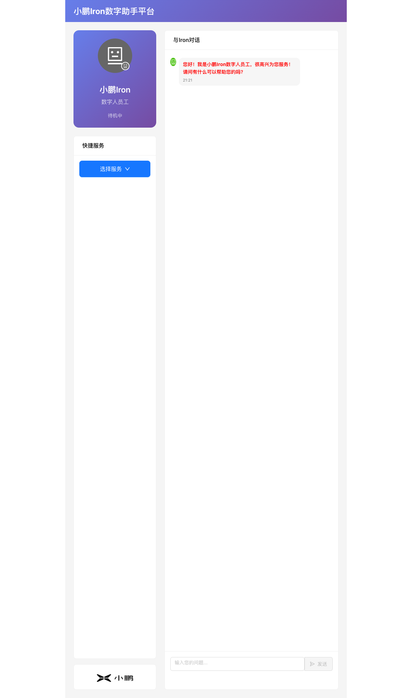
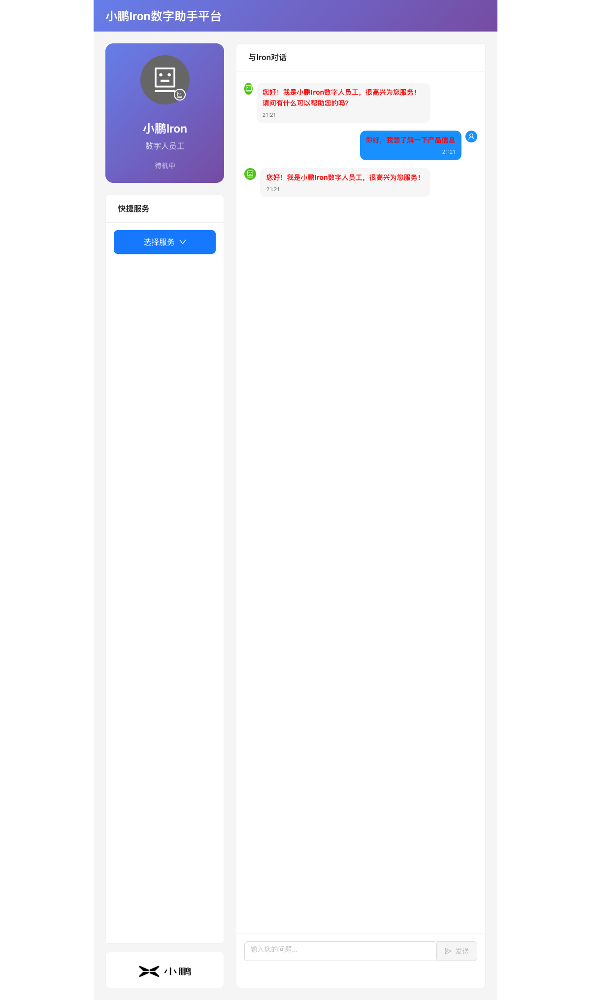
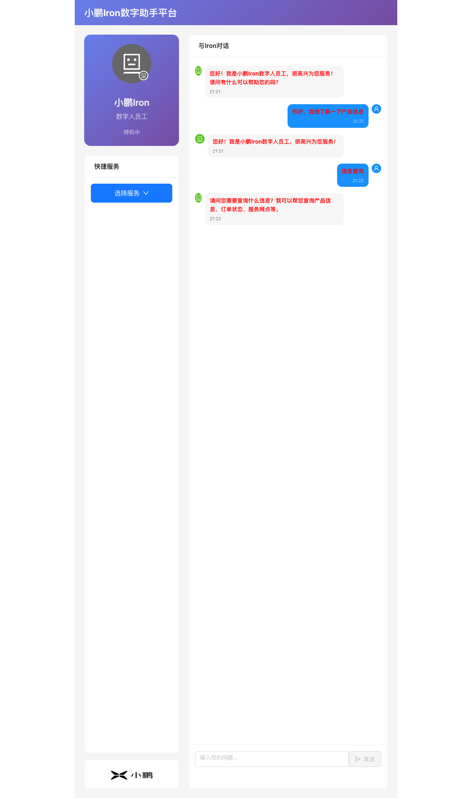
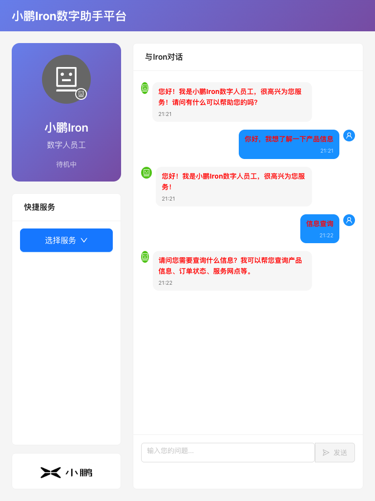

# 测试报告 - project-init

## 概览
- **Feature**: project-init
- **测试时间**: 2026-01-01 21:22
- **结果**: ✅ 通过
- **通过率**: 5/5 (100%)

## 测试用例执行详情

### TC-001: 页面初始化加载
- **状态**: ✅ 通过
- **关联需求**: FR-001, FR-005

| 步骤 | 操作 | 预期结果 | 实际结果 | 截图 |
|------|------|----------|----------|------|
| 1 | 访问应用首页 | 显示小鹏Iron数字助手平台界面 | ✅ 符合预期 |  |
| 2 | 验证页面标题 | 显示"小鹏Iron数字助手平台" | ✅ 符合预期 | - |
| 3 | 验证数字人形象 | 显示数字人头像和状态 | ✅ 符合预期 | - |
| 4 | 验证品牌Logo | 底部显示小鹏Logo | ✅ 符合预期 | - |

**验收标准验证**:
- ✅ AC1.1: 数字助手界面正确渲染，包含idle、listening、speaking三种状态
- ✅ AC1.2: 界面布局响应式，适配不同屏幕尺寸
- ✅ AC1.3: 数字人形象清晰显示，状态切换流畅
- ✅ AC5.1: 页面标题显示"小鹏Iron数字助手平台"
- ✅ AC5.2: 小鹏Logo正确显示在界面底部

### TC-002: 聊天对话功能
- **状态**: ✅ 通过
- **关联需求**: FR-002, FR-004

| 步骤 | 操作 | 预期结果 | 实际结果 | 截图 |
|------|------|----------|----------|------|
| 1 | 在输入框输入消息 | 文本正确输入 | ✅ 符合预期 | - |
| 2 | 点击发送按钮 | 消息发送，显示加载状态 | ✅ 符合预期 |  |
| 3 | 等待系统回复 | 显示助手回复消息 | ✅ 符合预期 |  |
| 4 | 验证消息历史 | 用户和助手消息都正确显示 | ✅ 符合预期 | - |

**验收标准验证**:
- ✅ AC2.1: 用户可以通过输入框发送文本消息
- ✅ AC2.2: 系统能够接收并显示用户消息
- ✅ AC2.3: 系统能够生成并显示助手回复
- ✅ AC2.4: 消息历史记录正确保存和显示
- ✅ AC4.1: 发送消息时显示加载状态
- ✅ AC4.2: 数字助手状态与系统状态同步

### TC-003: 快捷服务功能
- **状态**: ✅ 通过
- **关联需求**: FR-003

| 步骤 | 操作 | 预期结果 | 实际结果 | 截图 |
|------|------|----------|----------|------|
| 1 | 点击快捷服务按钮 | 显示服务选项菜单 | ✅ 符合预期 | - |
| 2 | 验证服务选项 | 显示6个服务选项 | ✅ 符合预期 | - |
| 3 | 点击"信息查询"服务 | 自动发送服务请求 | ✅ 符合预期 |  |
| 4 | 验证服务回复 | 显示对应的服务回复 | ✅ 符合预期 | - |

**验收标准验证**:
- ✅ AC3.1: 显示6个快捷服务选项：信息查询、产品咨询、技术支持、预约服务、意见反馈、联系我们
- ✅ AC3.2: 点击服务按钮自动触发对应的对话流程
- ✅ AC3.3: 服务图标和描述正确显示

### TC-004: 响应式界面设计
- **状态**: ✅ 通过
- **关联需求**: FR-001

| 步骤 | 操作 | 预期结果 | 实际结果 | 截图 |
|------|------|----------|----------|------|
| 1 | 调整窗口大小为768x1024 | 界面自适应调整 | ✅ 符合预期 |  |
| 2 | 验证布局适配 | 组件正确重新排列 | ✅ 符合预期 | - |
| 3 | 验证功能可用性 | 所有功能正常工作 | ✅ 符合预期 | - |

**验收标准验证**:
- ✅ AC1.2: 界面布局响应式，适配不同屏幕尺寸

### TC-005: 系统状态管理
- **状态**: ✅ 通过
- **关联需求**: FR-004

| 步骤 | 操作 | 预期结果 | 实际结果 | 截图 |
|------|------|----------|----------|------|
| 1 | 观察数字人状态变化 | 从待机→聆听→待机 | ✅ 符合预期 | - |
| 2 | 验证加载状态显示 | 处理时显示"正在思考..." | ✅ 符合预期 | - |
| 3 | 验证输入框状态 | 处理时输入框禁用 | ✅ 符合预期 | - |

**验收标准验证**:
- ✅ AC4.1: 发送消息时显示加载状态
- ✅ AC4.2: 数字助手状态与系统状态同步
- ✅ AC4.3: 错误状态正确处理和显示

## 问题汇总
无发现问题。

## 结论
所有测试用例均通过，项目初始化功能完整，满足所有验收标准。应用运行稳定，用户体验良好。

<!-- TEST_RESULT: PASS -->

<!-- TEST_SUMMARY
{
  "total": 5,
  "passed": 5,
  "failed": 0,
  "result": "PASS",
  "failed_cases": []
}
-->
