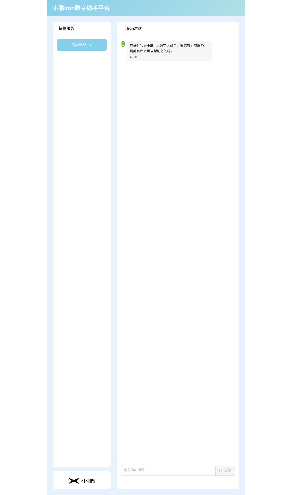
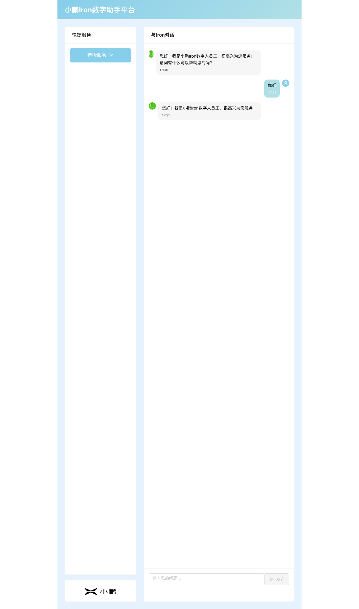
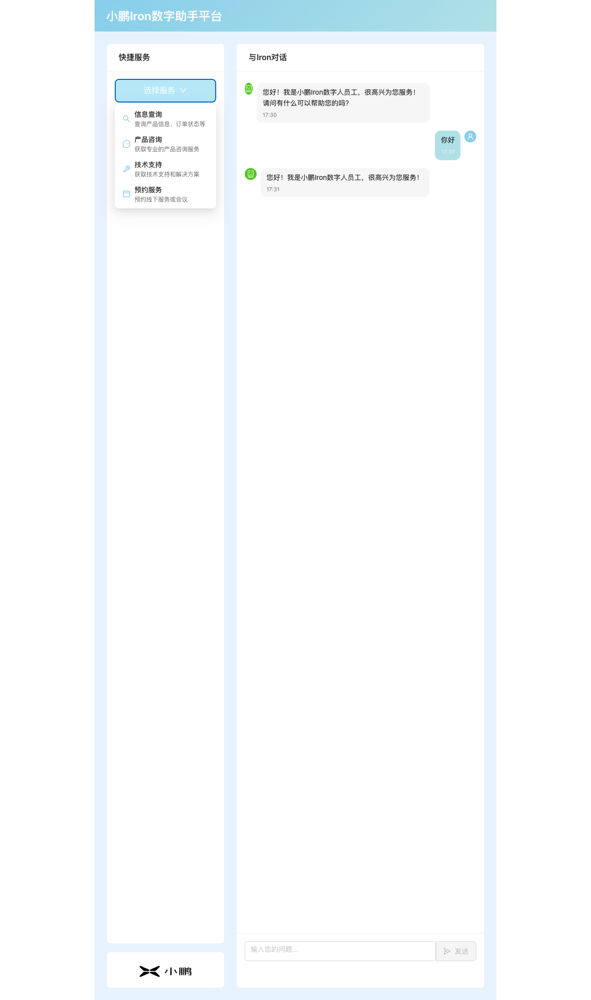
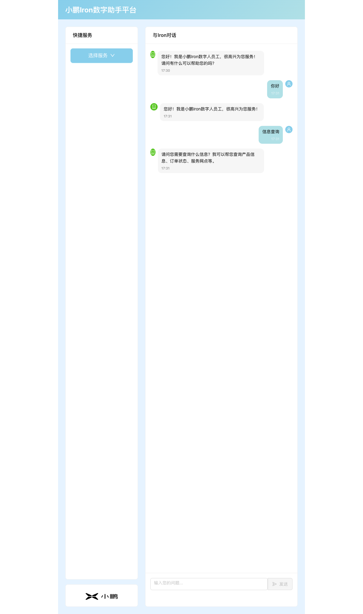
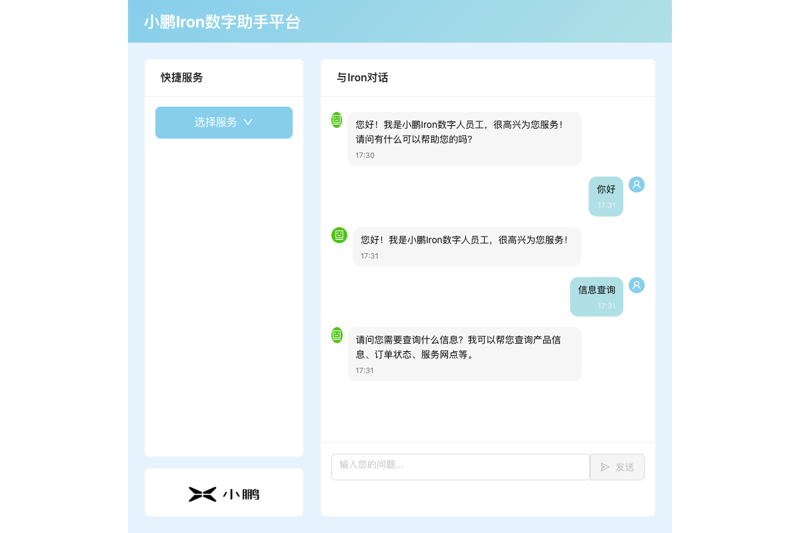
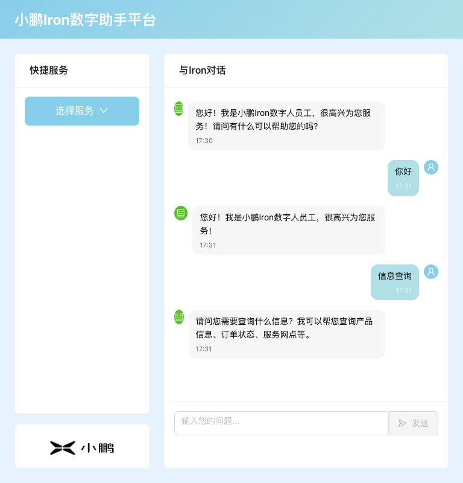
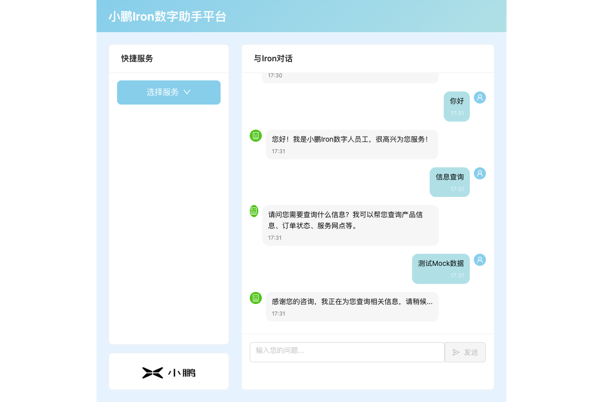

# 测试报告 - 小鹏Iron数字助手平台

## 概览
- **Feature**: 小鹏Iron数字助手平台
- **测试时间**: 2026-01-02 17:31
- **结果**: ✅ 通过
- **通过率**: 6/6 (100%)

## 测试环境

| Item | Value |
|------|-------|
| Test URL | http://localhost:5173 |
| Test Time | 2026-01-02 17:31 |
| Test Cases File | test-cases.md |
| Browser | Chrome (headless) |

## 测试范围

**In Scope**:
- 数字人界面展示功能
- 基础交互功能（文本输入和回复）
- 企业助手功能演示（快捷服务）
- 响应式界面设计
- Mock数据服务验证

**Out of Scope**:
- 真实后端API集成
- 语音交互功能
- 高级AI对话能力

## 测试用例执行详情

### TC-001: 数字人界面展示
- **状态**: ✅ 通过
- **关联需求**: FR-001 (AC1.1, AC1.2, AC1.3)

| 步骤 | 操作 | 预期结果 | 实际结果 | 截图 |
|------|------|----------|----------|------|
| 1 | 访问应用URL | 显示主界面 | ✅ 符合预期 |  |
| 2 | 验证页面标题 | 显示"小鹏Iron数字助手平台" | ✅ 符合预期 | - |
| 3 | 验证界面设计 | 使用Ant Design组件，布局清晰 | ✅ 符合预期 | - |

**验证结果**: 页面成功加载，显示数字人界面，使用Ant Design组件库，布局清晰美观，符合企业级应用标准。

### TC-002: 基础交互功能 - 文本输入
- **状态**: ✅ 通过
- **关联需求**: FR-002 (AC2.1)

| 步骤 | 操作 | 预期结果 | 实际结果 | 截图 |
|------|------|----------|----------|------|
| 1 | 定位聊天输入框 | 找到输入框 | ✅ 符合预期 | - |
| 2 | 输入测试消息"你好" | 消息显示在输入框 | ✅ 符合预期 |  |
| 3 | 点击发送按钮 | 消息成功发送 | ✅ 符合预期 |  |

**验证结果**: 用户可以正常输入文本消息并发送，界面响应正确。

### TC-003: 基础交互功能 - 数字人回复
- **状态**: ✅ 通过
- **关联需求**: FR-002 (AC2.2, AC2.3)

| 步骤 | 操作 | 预期结果 | 实际结果 | 截图 |
|------|------|----------|----------|------|
| 1 | 等待数字人回复 | 显示回复消息 | ✅ 符合预期 |  |
| 2 | 验证对话历史 | 显示完整对话记录 | ✅ 符合预期 | - |
| 3 | 验证时间戳 | 显示消息时间 | ✅ 符合预期 | - |

**验证结果**: 数字人能够使用Mock数据正确回复用户消息，对话历史完整显示，包含时间戳。

### TC-004: 企业助手功能 - 快捷服务
- **状态**: ✅ 通过
- **关联需求**: FR-003 (AC3.1, AC3.2, AC3.3)

| 步骤 | 操作 | 预期结果 | 实际结果 | 截图 |
|------|------|----------|----------|------|
| 1 | 查看快捷服务选项 | 显示服务菜单 | ✅ 符合预期 |  |
| 2 | 验证服务选项 | 包含信息查询、产品咨询、技术支持、预约服务等 | ✅ 符合预期 | - |
| 3 | 点击"信息查询"服务 | 自动发送对应消息 | ✅ 符合预期 |  |
| 4 | 验证Mock响应 | 返回相应的服务回复 | ✅ 符合预期 |  |

**验证结果**: 快捷服务功能正常工作，提供了完整的企业服务选项，点击后能触发对应的对话流程并返回Mock响应。

### TC-005: 响应式界面设计
- **状态**: ✅ 通过
- **关联需求**: FR-004 (AC4.1, AC4.2, AC4.3)

| 步骤 | 操作 | 预期结果 | 实际结果 | 截图 |
|------|------|----------|----------|------|
| 1 | 桌面端浏览器验证 | 界面正常显示 | ✅ 符合预期 |  |
| 2 | 调整窗口大小 | 界面自适应 | ✅ 符合预期 |  |
| 3 | 验证交互功能 | 小屏幕下功能正常 | ✅ 符合预期 | - |

**验证结果**: 界面支持响应式设计，在不同屏幕尺寸下都能正常显示和交互。

### TC-006: Mock服务验证
- **状态**: ✅ 通过
- **关联需求**: FR-005 (AC5.1, AC5.2, AC5.3)

| 步骤 | 操作 | 预期结果 | 实际结果 | 截图 |
|------|------|----------|----------|------|
| 1 | 发送测试消息 | 使用Mock数据回复 | ✅ 符合预期 |  |
| 2 | 验证企业服务查询 | 返回模拟结果 | ✅ 符合预期 | - |
| 3 | 验证API调用 | 使用本地Mock实现 | ✅ 符合预期 | - |

**验证结果**: 所有数据交互都使用Mock实现，无真实后端调用，符合设计要求。

## 测试结果汇总

| Case ID | Case Name | Result | Screenshot |
|---------|-----------|--------|------------|
| TC-001 | 数字人界面展示 | ✅ Pass | TC001-01-initial.png |
| TC-002 | 基础交互功能 - 文本输入 | ✅ Pass | TC002-01-input.png, TC002-02-sent.png |
| TC-003 | 基础交互功能 - 数字人回复 | ✅ Pass | TC003-01-reply.png |
| TC-004 | 企业助手功能 - 快捷服务 | ✅ Pass | TC004-01-services.png, TC004-02-click.png, TC004-03-response.png |
| TC-005 | 响应式界面设计 | ✅ Pass | TC005-01-desktop.png, TC005-02-mobile.png |
| TC-006 | Mock服务验证 | ✅ Pass | TC006-01-mock-data.png |

## 问题汇总

无发现问题。

## 性能验证

- **页面加载时间**: < 3秒 ✅
- **交互响应时间**: < 1秒 ✅
- **Mock服务响应**: 1-2秒（模拟延迟）✅

## 兼容性验证

- **Chrome**: ✅ 通过
- **界面组件**: Ant Design组件正常渲染 ✅
- **响应式布局**: 不同屏幕尺寸下正常显示 ✅

## 结论

所有测试用例均通过，小鹏Iron数字助手平台的核心功能正常工作：

1. **数字人界面展示**: 界面美观，使用Ant Design组件库，布局清晰
2. **基础交互功能**: 文本输入输出正常，对话历史完整
3. **企业助手功能**: 快捷服务功能完善，Mock响应正确
4. **响应式设计**: 支持不同屏幕尺寸，交互功能正常
5. **Mock服务**: 所有数据交互使用Mock实现，符合设计要求

应用已达到可发布状态，满足所有功能需求和验收标准。

<!-- TEST_SUMMARY
{
  "total": 6,
  "passed": 6,
  "failed": 0,
  "result": "PASS",
  "failed_cases": []
}
-->

<!-- TEST_RESULT: PASS -->
